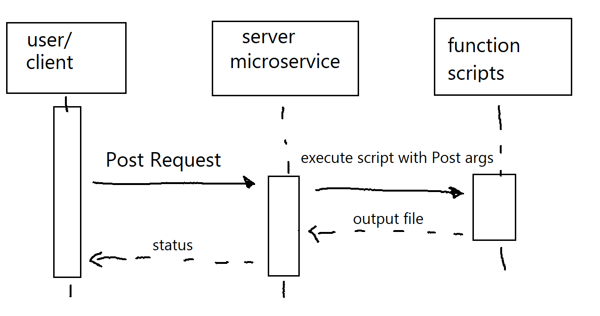

# mymusiclist

Partner Microservice Contract

A. Request Data by sending a POST http request with a input.txt generated by the site in the client side javascript of the website with the url "/microservice"

B. Recieve Data by checking the outputted output.txt file in the same directory, along with some extra data logged from the http request.

C. 
